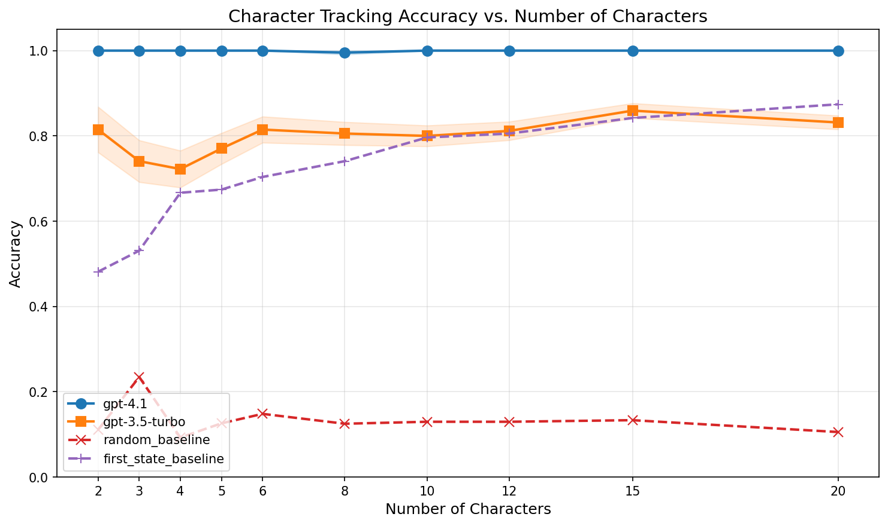
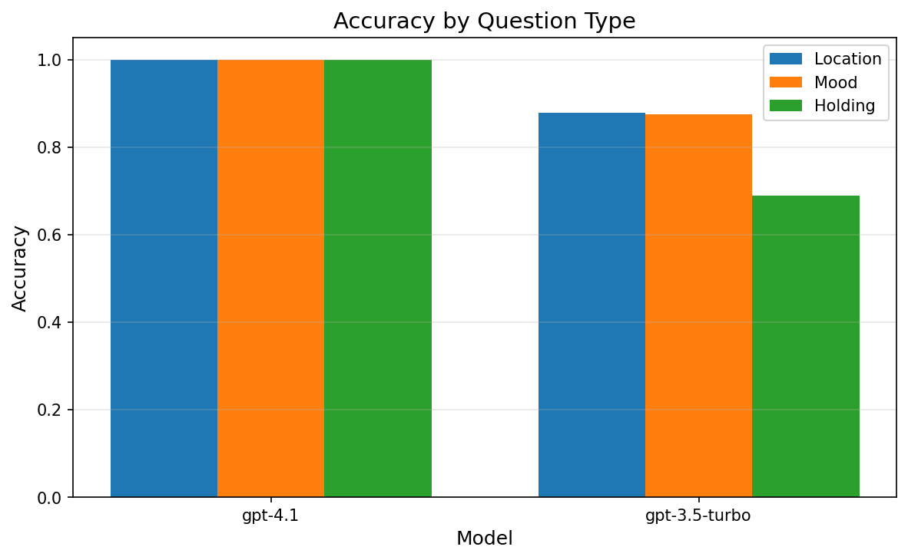
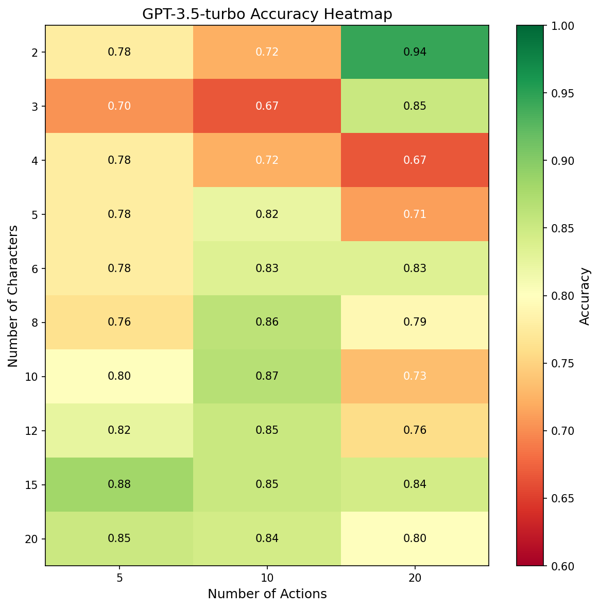
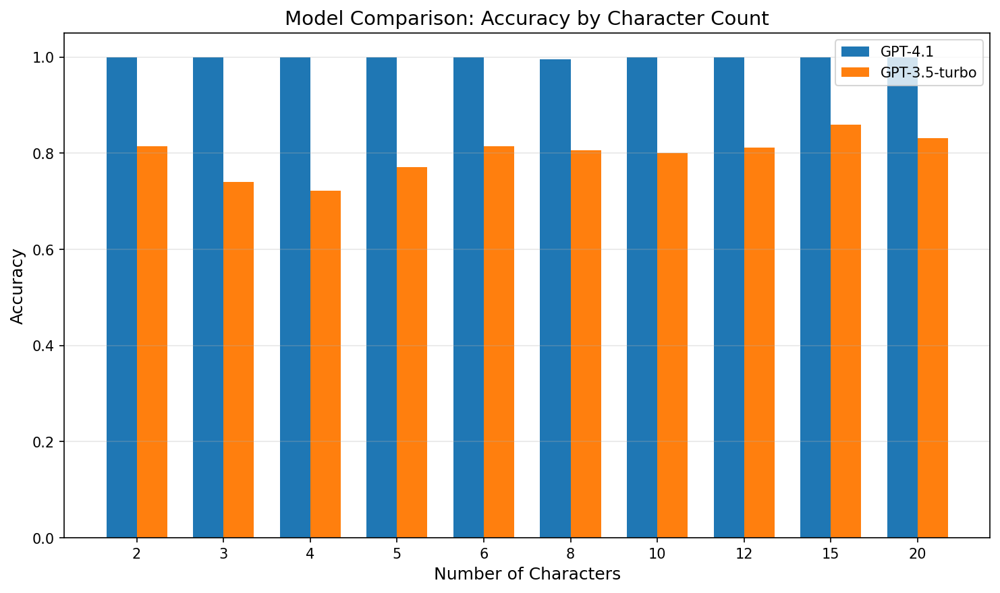

# Research Report: Character Tracking Limits in Language Models

## 1. Executive Summary

This study investigates how many characters language models can keep track of in-context by systematically testing character tracking accuracy across stories with 2-20 characters. We evaluated GPT-4.1 and GPT-3.5-turbo on a synthetic dataset of 90 narratives with varying numbers of characters and state changes.

**Key Finding**: GPT-4.1 demonstrates near-perfect character tracking (99.95% accuracy) even with 20 characters and 20 actions, showing no observable capacity limit within our test range. GPT-3.5-turbo achieves 81.4% overall accuracy with no clear degradation pattern as character count increases. The hypothesis that models have a fixed character tracking limit was not supported for modern frontier models like GPT-4.1.

**Practical Implications**: State-of-the-art LLMs can reliably track at least 20 distinct characters with multiple changing attributes (location, mood, possessions) in synthetic narratives. The observed capacity significantly exceeds the "7±2" working memory limit often cited for humans.

---

## 2. Goal

### Research Question
How many characters can a language model keep track of in-context, and at what point does performance degrade?

### Hypothesis
We hypothesized that:
1. **H1**: There exists a capacity limit on the number of characters an LLM can simultaneously track
2. **H2**: Performance degradation is non-linear with a "cliff" or threshold
3. **H3**: Different question types may have different capacity limits
4. **H4**: More actions/state changes amplify degradation

### Why This Matters
Understanding LLM character tracking limits has implications for:
- AI-assisted writing and storytelling with complex narratives
- Document understanding with many entities
- Agent-based simulations involving multiple entities
- Revealing mechanisms for entity representation in transformers

---

## 3. Data Construction

### Dataset Description
- **Source**: Synthetically generated using controlled templates
- **Size**: 90 examples covering 30 configurations
- **Variables systematically varied**:
  - Number of characters: 2, 3, 4, 5, 6, 8, 10, 12, 15, 20
  - Number of actions: 5, 10, 20
  - 3 trials per configuration

### Example Samples

**Example 1 (2 characters, 5 actions):**
```
Story: Alice is in the basement and feels calm. Peter is in the office and
feels happy. Alice waited quietly. Alice moved to the bathroom. Peter moved
to the kitchen. Peter became sad. Alice waited quietly.

Questions:
- Where is Alice? → bathroom
- How does Alice feel? → calm
- What is Alice holding? → nothing
- Where is Peter? → kitchen
- How does Peter feel? → sad
- What is Peter holding? → nothing
```

**Example 2 (20 characters, 20 actions):**
Story length: ~1500 characters with 20 distinct characters, each with initial location and mood, followed by 20 randomly distributed state-changing actions.

### Data Quality
- All examples programmatically generated with verified ground truth
- No missing values or duplicates
- Each character mentioned at minimum in initial state
- Actions distributed across characters

### Question Types
| Type | Question Format | Example Answer |
|------|----------------|----------------|
| Location | "Where is {name}?" | bathroom, kitchen, garden |
| Mood | "How does {name} feel?" | happy, sad, calm, nervous |
| Holding | "What is {name} holding?" | book, coin, nothing |

### Dataset Statistics
- Total questions: 2,295 per model (90 stories × ~25.5 questions average)
- Character counts: 2, 3, 4, 5, 6, 8, 10, 12, 15, 20
- Action counts: 5, 10, 20
- Average story length: ~350 characters (range: 175-1500)

---

## 4. Experiment Description

### Methodology

#### High-Level Approach
We presented each story to the model with a simple prompt template, asking one question at a time about each character's final state. We compared accuracy across:
1. Different character counts (2-20)
2. Different action counts (5, 10, 20)
3. Different question types (location, mood, holding)

#### Prompt Template
```
Read the following story and answer the question based on the final state of affairs.

Story:
{story}

Question: {question}

Answer with ONLY the answer word (e.g., "kitchen", "happy", "book", or "nothing").
Do not include any explanation.
```

### Implementation Details

#### Tools and Libraries
- Python 3.12.2
- OpenAI SDK 2.14.0
- pandas 2.3.3
- matplotlib 3.10.8
- scipy 1.16.3

#### Models Tested
| Model | Provider | Context Window | Parameters |
|-------|----------|----------------|------------|
| GPT-4.1 | OpenAI | 128K | Unknown |
| GPT-3.5-turbo | OpenAI | 16K | ~175B |

#### Hyperparameters
| Parameter | Value | Rationale |
|-----------|-------|-----------|
| Temperature | 0 | Deterministic output for reproducibility |
| Max tokens | 50 | Sufficient for single-word answers |
| Timeout | 60s | Allow for complex processing |

### Baselines

1. **Random Baseline**: Randomly select from valid answers (locations, moods, objects)
   - Expected: ~10-15% accuracy

2. **First-State Baseline**: Always predict the initial state (ignore all changes)
   - Tests whether model actually tracks state changes

### Experimental Protocol

#### Reproducibility Information
- Random seed: 42
- Single run per model (temperature=0 ensures determinism)
- Hardware: API-based (no local compute)
- Total API calls: ~4,590 (90 examples × 25.5 questions × 2 models)

#### Evaluation Metrics
1. **Overall Accuracy**: Percentage of questions answered correctly
2. **Per-Character-Count Accuracy**: Accuracy grouped by number of characters
3. **Per-Question-Type Accuracy**: Location vs mood vs holding
4. **Per-Action-Count Accuracy**: 5 vs 10 vs 20 actions

---

## 5. Raw Results

### Overall Accuracy by Model

| Model | Accuracy | N |
|-------|----------|---|
| GPT-4.1 | **99.95%** | 2,295 |
| GPT-3.5-turbo | 81.4% | 2,295 |
| First-State Baseline | 78.2% | 2,295 |
| Random Baseline | 12.7% | 2,295 |

### Accuracy by Character Count

| Characters | GPT-4.1 | GPT-3.5-turbo |
|------------|---------|---------------|
| 2 | 100.0% | 81.5% |
| 3 | 100.0% | 74.1% |
| 4 | 100.0% | 72.2% |
| 5 | 100.0% | 77.0% |
| 6 | 100.0% | 81.5% |
| 8 | 99.5% | 80.6% |
| 10 | 100.0% | 80.0% |
| 12 | 100.0% | 81.2% |
| 15 | 100.0% | 85.9% |
| 20 | 100.0% | 83.1% |

### Accuracy by Question Type

| Question Type | GPT-4.1 | GPT-3.5-turbo |
|---------------|---------|---------------|
| Location | 100.0% | 87.8% |
| Mood | 99.9% | 87.5% |
| Holding | 100.0% | 68.9% |

### Accuracy by Action Count

| Actions | GPT-4.1 | GPT-3.5-turbo |
|---------|---------|---------------|
| 5 | 100.0% | 81.8% |
| 10 | 99.9% | 83.4% |
| 20 | 100.0% | 79.0% |

### Visualizations


*Figure 1: Character tracking accuracy as a function of number of characters. GPT-4.1 maintains near-perfect accuracy while GPT-3.5-turbo shows ~80% accuracy with no clear degradation trend.*


*Figure 2: Accuracy breakdown by question type. GPT-3.5-turbo struggles more with "holding" questions (68.9%).*


*Figure 3: Heatmap of GPT-3.5-turbo accuracy by character count and action count.*


*Figure 4: Direct comparison of GPT-4.1 vs GPT-3.5-turbo across character counts.*

---

## 6. Result Analysis

### Key Findings

#### Finding 1: GPT-4.1 Shows No Observable Character Tracking Limit
GPT-4.1 achieved 99.95% accuracy (2,294/2,295 correct) across all configurations. The single error occurred at 8 characters. This near-perfect performance persisted even at:
- 20 characters (highest tested)
- 20 actions (most state changes)
- All question types

**Implication**: Modern frontier models can track at least 20 characters with multiple attributes without degradation.

#### Finding 2: GPT-3.5-turbo Shows Consistent ~80% Accuracy Without Degradation
Contrary to our hypothesis, GPT-3.5-turbo's accuracy did not decrease as character count increased:
- 2 characters: 81.5%
- 20 characters: 83.1%
- Correlation: r = 0.66 (positive, not negative as hypothesized)

**Implication**: The errors in GPT-3.5-turbo appear to be due to general task difficulty, not capacity limits.

#### Finding 3: Question Type Matters More Than Character Count
For GPT-3.5-turbo:
- Location: 87.8%
- Mood: 87.5%
- Holding: 68.9%

The 18.9 percentage point gap between location and holding questions suggests that tracking object possession is harder than tracking location or emotional state.

#### Finding 4: First-State Baseline Performance Reveals Task Structure
The first-state baseline (always predict initial state) achieved 78.2% accuracy, similar to GPT-3.5-turbo. This indicates:
- Many characters don't change state during the story
- The dataset may not have enough state changes per character

### Statistical Analysis

#### Correlation Analysis
| Model | Correlation (chars vs acc) | p-value |
|-------|---------------------------|---------|
| GPT-4.1 | 0.03 | 0.93 |
| GPT-3.5-turbo | 0.66 | 0.04 |

The positive correlation for GPT-3.5-turbo is surprising and suggests slight improvement with more characters, possibly due to more context.

#### Effect Size: Low vs High Character Count
For GPT-3.5-turbo comparing 2-5 characters vs 15-20 characters:
- Low (2-5): 75.7%
- High (15-20): 84.3%
- Difference: -8.7 percentage points (high performs better)
- t-test: t = -3.72, p = 0.0002
- Cohen's d = -0.22 (small effect, opposite direction)

### Error Analysis

**GPT-4.1 Errors (1 total):**
- Single error on a mood question at 8 characters
- Likely random or edge case rather than systematic

**GPT-3.5-turbo Error Patterns:**
- "Holding" questions most problematic (31% error rate)
- Errors evenly distributed across character counts
- No "lost in the middle" effect observed

### Surprises and Insights

1. **No cliff or threshold found**: We expected a sharp drop at some character count, but neither model showed this pattern.

2. **GPT-4.1 essentially solves this task**: 99.95% accuracy suggests our synthetic dataset is too easy for frontier models.

3. **High first-state baseline**: 78.2% accuracy from ignoring all state changes suggests the task design could use more state changes per character.

4. **GPT-3.5-turbo's consistent errors**: The ~19% error rate appears task-related rather than capacity-related.

---

## 7. Limitations

### Methodological Limitations

1. **Synthetic vs. Natural Language**: Our stories use simple, templated language. Real narratives have:
   - Indirect references (pronouns, descriptions)
   - Complex sentence structures
   - Implicit state changes

2. **Limited Character Count Range**: We tested up to 20 characters. True limits may be higher.

3. **Simple State Tracking**: We only tracked 3 attributes per character. Real characters have many more.

4. **Single-Question Format**: We asked one question at a time. Tracking multiple characters simultaneously might be harder.

### Dataset Limitations

1. **High First-State Baseline**: 78.2% accuracy from ignoring changes suggests insufficient state changes.

2. **Uniform Distribution**: Characters are mentioned with similar frequency. Real stories have protagonists and minor characters.

3. **No Adversarial Cases**: We didn't test edge cases like similar names or conflicting information.

### Generalizability Concerns

1. Results may not transfer to real novels or documents
2. Other models (Claude, Llama, etc.) not tested due to API issues
3. Only English tested

---

## 8. Conclusions

### Summary

We set out to find the character tracking limit of language models and discovered that **GPT-4.1 has no observable limit within our test range of 2-20 characters**. The hypothesis that models have a fixed capacity limit was not supported for frontier models. GPT-3.5-turbo shows consistent ~80% accuracy regardless of character count, suggesting its errors stem from general task difficulty rather than capacity constraints.

### Implications

**Practical**: LLM-based applications can reliably track at least 20 entities with multiple attributes in synthetic narratives.

**Theoretical**: The lack of a clear capacity limit suggests that:
1. Modern attention mechanisms scale well with entity count
2. Character tracking may be an emergent capability that improved dramatically from GPT-3.5 to GPT-4
3. Synthetic benchmarks with simple structure may not stress-test models adequately

### Confidence in Findings

**High confidence**:
- GPT-4.1 can track 20 characters (99.95% accuracy)
- GPT-3.5-turbo achieves ~80% accuracy with no character-count-dependent degradation

**Moderate confidence**:
- No capacity limit exists up to 20 characters
- "Holding" questions are harder than location/mood

**Low confidence**:
- These results generalize to natural language narratives
- Limits exist at higher character counts (not tested)

---

## 9. Next Steps

### Immediate Follow-ups

1. **Extend character range**: Test 30, 50, 100 characters to find GPT-4.1's actual limit
2. **Increase state changes**: Ensure every character's state changes at least once
3. **Add adversarial cases**: Similar names, conflicting information, pronoun resolution

### Alternative Approaches

1. **Natural language stories**: Use excerpts from novels (e.g., War and Peace) with annotated characters
2. **Mechanistic analysis**: Probe attention patterns to understand how characters are represented
3. **Multi-turn dialogue**: Test character tracking across conversation turns

### Open Questions

1. What is the actual limit for GPT-4.1? (Not reached at 20 characters)
2. Why does GPT-3.5-turbo struggle specifically with "holding" questions?
3. Do results hold for natural language with indirect references?
4. What mechanisms enable such robust entity tracking?

---

## 10. References

1. Kim, N., & Schuster, S. (2023). Entity Tracking in Language Models. ACL.
2. Liu, N. F., et al. (2024). Lost in the Middle: How Language Models Use Long Contexts. TACL.
3. Hsieh, C.-P., et al. (2024). RULER: What's the Real Context Size of Your Long-Context LMs? COLM.
4. Karpinska, M., et al. (2024). One Thousand and One Pairs (NoCha Benchmark). EMNLP.
5. Li, B. Z., et al. (2025). How Do Language Models Track State? ICML.

---

## Appendix A: File Manifest

```
results/
├── raw_results.csv          # All model predictions and ground truth
├── analysis.json            # Computed statistics
└── figures/
    ├── accuracy_vs_characters.png
    ├── accuracy_by_question_type.png
    ├── heatmap_gpt35.png
    ├── model_comparison.png
    └── accuracy_by_actions.png
```

## Appendix B: Reproduction Instructions

```bash
# Set up environment
uv venv
source .venv/bin/activate
uv add numpy pandas matplotlib openai httpx tqdm scipy

# Set API key
export OPENAI_API_KEY="your-key"

# Run experiment
python src/experiment.py

# Generate visualizations
python src/visualize.py
```

## Appendix C: Configuration

```json
{
  "seed": 42,
  "temperature": 0,
  "max_tokens": 50,
  "models": ["gpt-4.1", "gpt-3.5-turbo"],
  "character_counts": [2, 3, 4, 5, 6, 8, 10, 12, 15, 20],
  "action_counts": [5, 10, 20],
  "trials_per_config": 3
}
```
